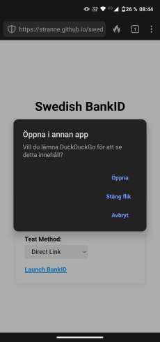

TLDR: How to launch the Swedish BankID application on various browsers on different devices when you have an autostart-token.

<!-- truncate -->

A summary of my experience after working with a few BankID integrations. I have found that the official documentation is a bit light in certain areas. This blog post provides the insights I wish I had when I began working with BankID.

## Background

Swedish BankID is a Swedish national digital identification and signing service provided by the largest banks in Sweden. There are on average 18 million identifications and signatures done each day with BankID ([April 2024](https://www.bankid.com/en)).

* [Who can get BankID](https://www.bankid.com/en/privat/skaffa-bankid)
* [Which banks provide BankID](https://www.bankid.com/en/privat/kontakt-privatpersoner)
* [BankID application system requirements](https://support.bankid.com/en/technical-issues-and-problems/system-requirements)

## Integration basis

To integrate BankID, you need a partnership with either one of [these banks](https://www.bankid.com/en/foretag/anslut-foeretag), or a vendor which integrates with BankID. Some vendors offer a GUI that manages most of the implementation on your behalf. This post, however, focuses on scenarios where you handle the end user interface yourself.

To gain a deeper understanding of BankID’s technical details, check their [developer page](https://developers.bankid.com/getting-started/introduction).

Document sections of interest:

* [Use cases](https://developers.bankid.com/getting-started/use-cases)
* [Backend API references](https://developers.bankid.com/api-references/auth--sign/overview)
* [Recommended text messages](https://developers.bankid.com/resources/user-messages)
* [Frontend - Autostart](https://developers.bankid.com/getting-started/frontend/autostart)
* [Frontend - QR code](https://developers.bankid.com/getting-started/frontend/qr-code)

Condensed version of how the flow looks like, from a frontend perspective:

1. Homepage calls an endpoint to make a request to get a session
2. Homepage keeps polling for the latest information repeatedly, around each second
3. User clicks a button, or scans a QR code, on the homepage
4. Polling status will update based on user’s state in the process. Interaction within the BankID app affects the state. State is used to select which message is displayed on the homepage.
5. When complete, backend should process and respond with updated polling message, where the homepage can show a message or redirect to another page

### Complementing thoughts

When authenticating or signing you may want to lock a session to a specific social security number. For example, a specific individual who needs to sign something. When providing a social security number when creating a new session, the BankID application will only allow that person to complete the request, filtering out any other BankIDs available on the device, for example if multiple people are sharing a tablet.

Usually there is a transaction fee for each BankID session created, so you might want to avoid always creating a BankID session when the user lands on a specific page and wait until they have integrated with the page before creating it. To prevent web crawlers or other scanning tools from initiate sessions, configure your logic to not trigger new BankID sessions when a page is loaded. If using automatic scanning tools which interact with the webpage, make sure to configure them to avoid them starting new session. For example, blocking the endpoint to request a new session.

### Testing

BankID provide two environment for external use; production and test. For production you can get a personal BankID [through your bank](https://www.bankid.com/en/privat/skaffa-bankid). For test, you can create and download one, for any Swedish social security number, through [Demo Bank](https://demo.bankid.com/). More information available in [BankID developer documentation](https://developers.bankid.com/test-portal/test-information).

### Same device vs other device

An end user can use BankID on the same device, by clicking on a button, or through scanning a QR code, displayed on the homepage, with the Mobile BankID app on a mobile device. If the user is on a desktop’s browser, and does not have BankID app installed on that machine, they may want to use their mobile device instead.

The browser can generate QR codes, for example through an NPM package. An alternative is to let the backend generate a SVG image and return the text for it, leaving it up for the client to only display it, keeping the implementation on the client side simple.

The QR code needs to change every 1-2 seconds, or it will become invalid when the end user scans it. This security measure prevents unauthorized use by ensuring that the QR code expires quickly, making it difficult for an attacker to manipulate a victim into completing the session.

It is best practice to provide the user the option to switch between using the same and other device. Another approach is to also provide the option to abort a BankID session.

Going forward, this post will focus on how to open the BankID application on the same device, through a button, and especially how to create its URL.

## Technical basis

The [official documentation for implementing frontend](https://developers.bankid.com/getting-started/frontend/autostart) is light on detail in the *launching from a browser* section.

Next, we will explore how to create a same-device URL.

### URI schemes

There are two ways, URI schemes, of launching the BankID application in a browser. These are:

1. bankid:///?autostarttoken=[TOKEN]
2. https://app.bankid.com/?autostarttoken=[TOKEN]

BankID [states](https://developers.bankid.com/getting-started/frontend/autostart) that the first works for all browsers on PC, and the second for mobile devices such as iOS and Android. In practice, compatibility varies depending on the browser and operating system combination, necessitating custom configuration for optimal end user experience.

If the BankID app fails to open when using the second option, [this page](https://app.bankid.com/) is displayed in the browser for the end user, which includes information for ends user on how to solve the issue. See below how to prevent this from happening consistently for certain operating systems and browsers.

The autostart token, [TOKEN] in examples, is a [UUID/GUID](https://en.wikipedia.org/wiki/Universally_unique_identifier).

### UI texts

BankID has [recommended text messages](https://developers.bankid.com/resources/user-messages) to be displayed for the end user in different states. In addition to these, you can also look at [test BankID](https://test.bankid.com/) as a source of inspiration for text that can be seen as more aligned with official messaging.

## Implementing launch

First, we use the User-Agent string to identify the user’s operating system and browser. This will be used for the [returnUrl](#returnurl)-value and selecting which [URI-scheme](#uri-schemes) to use.

There are two ways of opening the BankID application.

1. Autostart the app (optional)
2. User clicks on a button/link to open it

Different operating systems and browser combinations have different limitations, and not both options will work for all. Open this [tool](https://stranne.github.io/swedish-bankid-launch-tester/) on different devices’ browsers to see how they behave when launching the app. See the in-depth description below for future details.

### Identify operating system and browser

When identifying which device the user is using, you can use the [User-Agent](https://developer.mozilla.org/en-US/docs/Web/HTTP/Headers/User-Agent).

There is a new API, experimental as of October 2024, called [User-Agent Client Hints API](https://developer.mozilla.org/en-US/docs/Web/API/User-Agent_Client_Hints_API). Probably best to combine this with User-Agent as a fallback, if going with this approach, until [support](https://caniuse.com/mdn-api_navigator_useragentdata) improves.

### Identify iPad

Be aware that iPads can easily be misinterpreted as macOS devices, based on their User-Agent. See the second example below.

iPad user agent examples:

1. Mozilla/5.0 (**iPad**; U; CPU OS OS 3_2 like Mac OS X; en-us) AppleWebKit/531.21.10 (KHTML, like Gecko) Version/4.0.4 Mobile/7B367 Safari/531.21.10
2. Mozilla/5.0 (Macintosh; Intel Mac OS X 10_15) AppleWebKit/605.1.15 (KHTML, like Gecko) Version/13.0 Safari/605.1.15

To differentiate iPads from macOS devices based on their User-Agent, you can check if multi-touch is supported using the following JavaScript code: ``navigator && navigator.maxTouchPoints > 1``. This logic is also utilized in the [is-mobile NPM package](https://www.npmjs.com/package/is-mobile), which forms the basis for the [BankID sample code](https://github.com/BankID/SampleCode).

### iframe

https://app.bankid.com/ blocks iframes with the http header *[X-Frame-Options](https://developer.mozilla.org/en-US/docs/Web/HTTP/Headers/X-Frame-Options):
DENY*, as well as their [content security policy](https://developer.mozilla.org/en-US/docs/Web/HTTP/CSP) configuration of *default-src 'self'*.

When using [sandbox](https://developer.mozilla.org/en-US/docs/Web/HTML/Element/iframe#sandbox)-attribute one has to specify *allow-top-navigation* to allow the bankid:// URL to be able/allowed to open the external app. Using iframe will prevent the app from starting on some browsers, compare to using a direct link or assigning the URL via *window.location*. Personally, I do not see that this option would add much security, but some security experts may see some benefits, even for custom URI schemes.

### Autostart

You can use *window.location* to specify to launch the URL. An alternative is to create a link which you programmatically trigger the click event. However, this can be blocked, especially if this is not triggered in relation to a user interaction.

## Open on iOS

iOS has a restricted behavior regarding opening external applications. Therefore, you need to use the https://app.bankid.com/?autostarttoken=[TOKEN] URL, while also providing the *returnUrl* value when requesting BankID session. This returnUrl value helps to go back to the webpage after the user has finished in the BankID application.

There are a few things to be aware of when creating this URL.

### returnUrl

For iOS you need a returnUrl value to handle the case with non Safari browsers. For other operating systems, this value can be left empty. If this value is missing, the end user will be left in the BankID app after completion on iOS. Note that the URL used as this value depends on which browser the user is using, see [below](#browser-uri-schemes) for details.

It can also be set as a query parameter to the launch URL, `redirect=[REDIRECT]`, but this is now deprecated and should now be entered when requesting a new BankID session. If returnUrl is set when requesting a new session, any redirect query in the URL will be ignored. It is currently unclear how long the deprecated URL parameter will be supported, consult the [BankID technical documentation](https://developers.bankid.com/getting-started/frontend/autostart) for the latest information.

#### URL encoded

Previously, when using the redirect value in the URL, it was part of a query parameter and needed to be encoded. It could be done with JavaScript; [encodeURI()](https://developer.mozilla.org/en-US/docs/Web/JavaScript/Reference/Global_Objects/encodeURI).

As an example, the return URL https://example.com/sign-in/ should be encoded to https%3A%2F%2Fexample.com%2Fsign-in%2F.

### Fragment identifier

You may want to be able to get back to the homepage without having to reload the page again, which will break any client side logic currently running. This can be achieved by using a fragment identifier, adding a #-character at the end of the URL.

If you have https://example.com/sign-in/, and want to create a redirectUrl for this page, use https://example.com/sign-in/#.

### Browser URI schemes

iOS will default to the Safari browser. If a user is using Chrome on iOS, if not handle specifically, the user will get redirected to the specified page in Safari, instead of Chrome. Since that browser will not have access to the homepage’s session, it should fail processing the BankId session. Therefore, make sure to also include the URL scheme for the browser that is being used on iOS. You need to identify each browser, you want to support on iOS, and specify the correct URI scheme to open that specific browser when end user has completed the request in the BankID app. You can see statistics of browsers popularity for countries and operating system [here](https://radar.cloudflare.com/reports/browser-market-share-2024-q1#id-8-market-share-by-country-and-os).

Some browsers support URI scheme to open the app with the previous displayed web page. To ensure the expected result, specify the URL which the user should be redirected to. There is a risk that the user will be shown the [https://app.bankid.com/](https://app.bankid.com/) otherwise, and might not consider clicking back to get to your homepage again.

In the table below, replace [URL] with the return url, such as https://example.com/sign-in/.

| Browser     | Open app URI    | Open app with specific page URI |
| ----------- | --------------- | ------------------------------- |
| Chrome      | googlechrome:// | googlechrome://[URL]            |
| Firefox     | firefox://      | firefox://[URL]                 |
| Edge        |                 | microsoft-edge-[URL]            |
| Brave       | brave://        | brave://open-url?url=[URL]      |
| DuckDuckGo  |                 | ddgQuickLink://[URL]            |
| Opera Touch |                 | touch-[URL]                     |
| Arc Browser |                 | arcmobile2://[URL]              |

List of wide range of iOS URI Schemes for third-party applications can be found at https://davidblue.wtf/urlschemes/.

Be aware that while Arc Browser has a URI Scheme to open it, I have not personally found a way to identify this browsers from others, probably due to privacy concern, making it impossible to know when to use it.

### Examples

Putting this all together for https://example.com/sign-in/.

Launch URL will always be https://app.bankid.com/?autostarttoken=[TOKEN] for iOS and only the returnUrl will differ.

iOS with Safari:

* returnUrl: https://example.com/sign-in/

iOS with Chrome:

* returnUrl: googlechrome://https://example.com/sign-in/

iOS with Edge:

* returnUrl: microsoft-edge-https://example.com/sign-in/

## Open on Android

BankID’s developer documentation states that https://app.bankid.com/ URL scheme should be used for Android devices. Signicat, an identity solution provider, [states](https://developer.signicat.com/identity-methods/sbid/integration-guide/auth-rest-api/headless/#field-descriptions-1) that modern Android should use the URI, while Android 4 & 5 should use bankid:// URI scheme instead.

Different browsers behave differently on Android. Therefore, testing browser behavior is crucial for ensuring the consistency launching of bankID application. See the table comparison below, tested on Android 11 (as of October 2024).

Legends:

* 🖱️ - Direct link
* ⏰ - window.location
* 🏦 - bankid://
* 🔗 - https://app.bankid.com/

| Browser                                                                                                | 🖱️ - 🏦                           | 🖱️ - 🔗                                      | ⏰ - 🏦                           | ⏰ - 🔗                                      |
| ------------------------------------------------------------------------------------------------------ | ---------------------------------- | --------------------------------------------- | ---------------------------------- | --------------------------------------------- |
| [Chrome](https://play.google.com/store/apps/details?id=com.android.chrome)                             | ✅                                 | ✅                                           | ✅                                 | ✅                                           |
| [Firefox](https://play.google.com/store/apps/details?id=org.mozilla.firefox)                           | ✅ 💬 [1](#firefox)    | ✅ 💬 [1](#firefox)               | ✅ 💬 [1](#firefox)    | ✅ 💬 [1](#firefox)               |
| [Edge](https://play.google.com/store/apps/details?id=com.microsoft.emmx)                               | ✅                                 | ⚠️ 💬 [2](#edge)                 | ✅                                 | ⚠️ 💬 [2](#edge)                  |
| [DuckDuckGo](https://play.google.com/store/apps/details?id=com.duckduckgo.mobile.android)              | ✅ 💬 [3](#duckduckgo) | ⚠️ 💬 [3](#duckduckgo)            | ✅ 💬 [3](#duckduckgo) | ⚠️ 💬 [3](#duckduckgo)            |
| [Samsung Internet Browser](https://play.google.com/store/apps/details?id=com.sec.android.app.sbrowser) | ✅                                 | ❌ [4](#samsung-internet-browser) | ✅                                 | ❌ [4](#samsung-internet-browser) |
| [Opera](https://play.google.com/store/apps/details?id=com.opera.browser)                               | ✅                                 | ✅                                           | ✅                                 | ✅                                           |
| [Brave](https://play.google.com/store/apps/details?id=com.brave.browser)                               | ✅                                 | ✅                                           | ✅                                 | ✅                                           |

Use [this simple test tool](https://stranne.github.io/swedish-bankid-launch-tester/) to evaluate different devices and their browsers.

### Firefox

Same behavior for all combinations, where the user is prompted. If user declines, nothing happens for bankid://, and the site is shown for https://app.bankid.com/.

### Edge

When using URL scheme https://app.bankid.com/, the user is prompted and asked if they would like to open the external app until they select remember.

### DuckDuckGo

There is a prompt displayed for bankid:// URI Scheme.

For URL scheme https://app.bankid.com/ the user is prompted with a discrete options at the bottom of the https://app.bankid.com/ page, as seen below.

### Samsung Internet Browser

This browser does not support https://app.bankid.com/ URL scheme. It only displays the page without any option to open the external BankID app. Only use bankid:// for this browser.

### Examples

* bankid:///?autostarttoken=[TOKEN]
* https://app.bankid.com/?autostarttoken=[TOKEN]

## Open on Desktop (Windows & macOS)

For desktop, it is straight forward. Use bankid:///?autostarttoken=[TOKEN] to open the application.

### Example

* bankid:///?autostarttoken=[TOKEN]

## Disclaimer

This information is provided as is. Follow your own judgment and official documentation.

## Additional resources

* [Official homepage](https://www.bankid.com/en)
  * [Get personal BankID](https://www.bankid.com/en/privat/skaffa-bankid)
  * [System requirements](https://support.bankid.com/en/technical-issues-and-problems/system-requirements)
* [Developer documentation](https://developers.bankid.com/)
  * [Backend API references](https://developers.bankid.com/api-references/auth--sign/overview)
  * [Frontend: Autostart](https://developers.bankid.com/getting-started/frontend/autostart)
  * [Frontend: QR code](https://developers.bankid.com/getting-started/frontend/qr-code)
  * [Recommended user messages](https://developers.bankid.com/resources/user-messages)
  * [Testing](https://developers.bankid.com/test-portal/test-information)
  * [Use cases](https://developers.bankid.com/getting-started/use-cases)
* [Demo](https://www.bankid.com/demo)
* [Demo Bank](https://demo.bankid.com/)
* [GitHub](https://github.com/bankid)
  * [Sample code](https://github.com/BankID/SampleCode)
